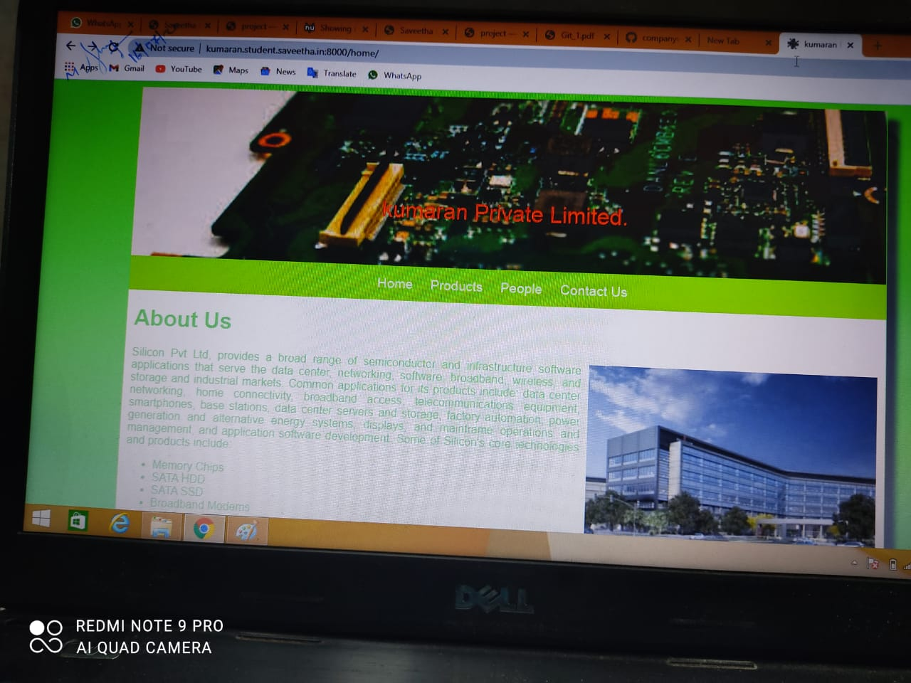
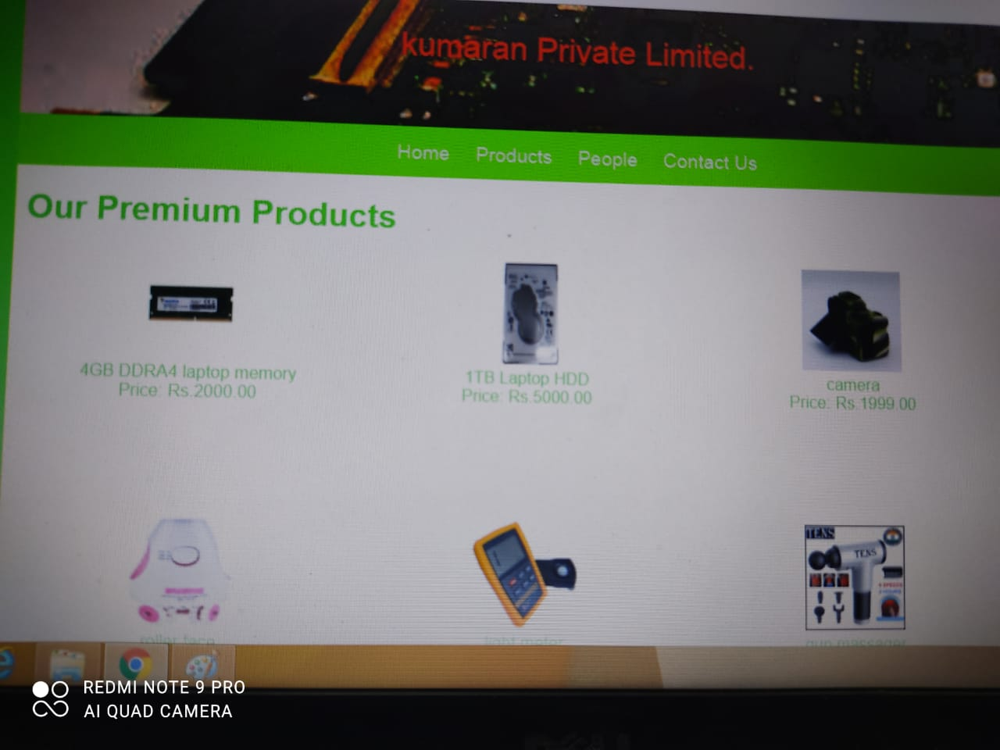
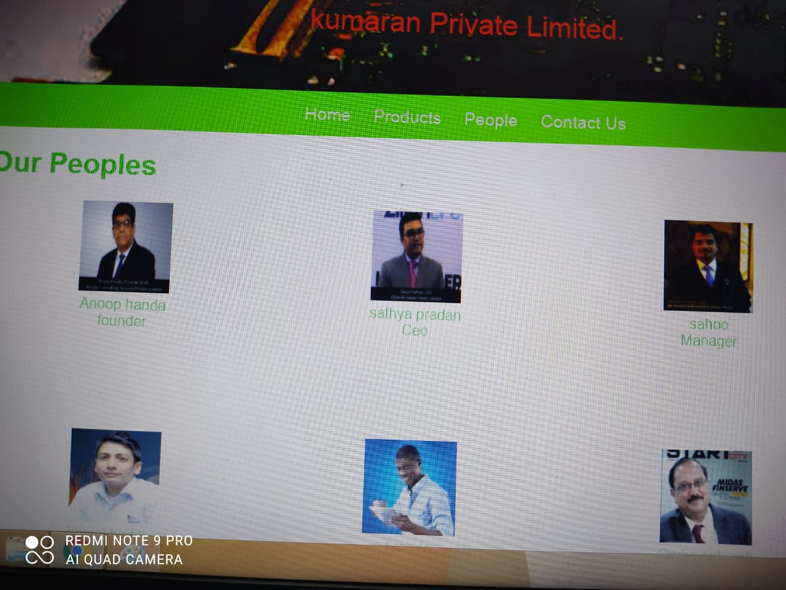
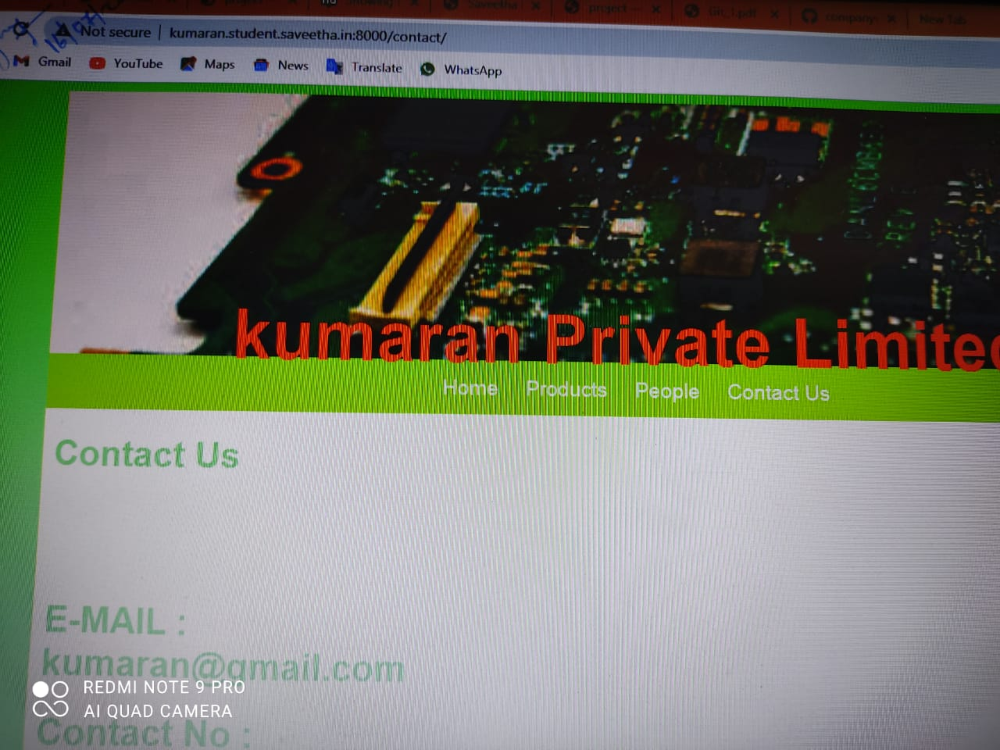
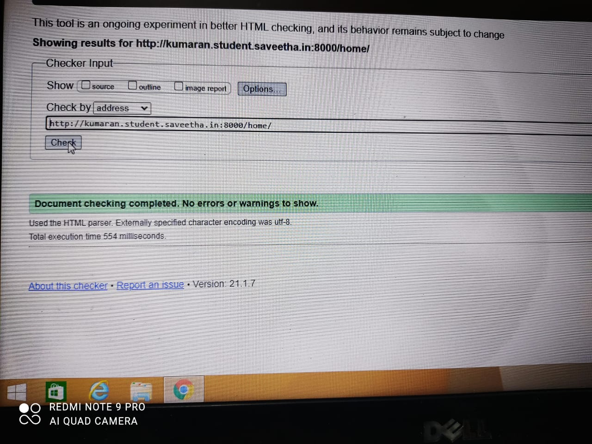
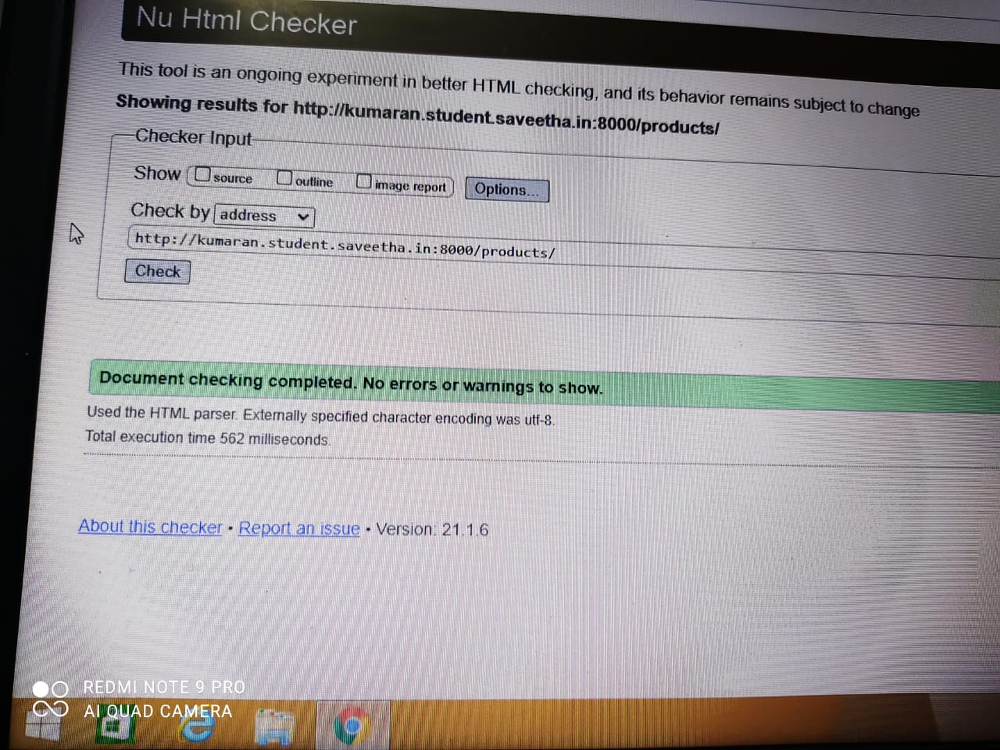
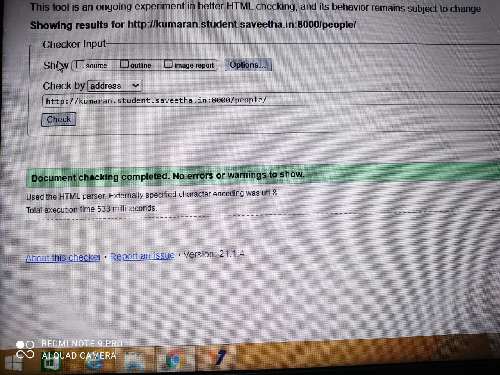
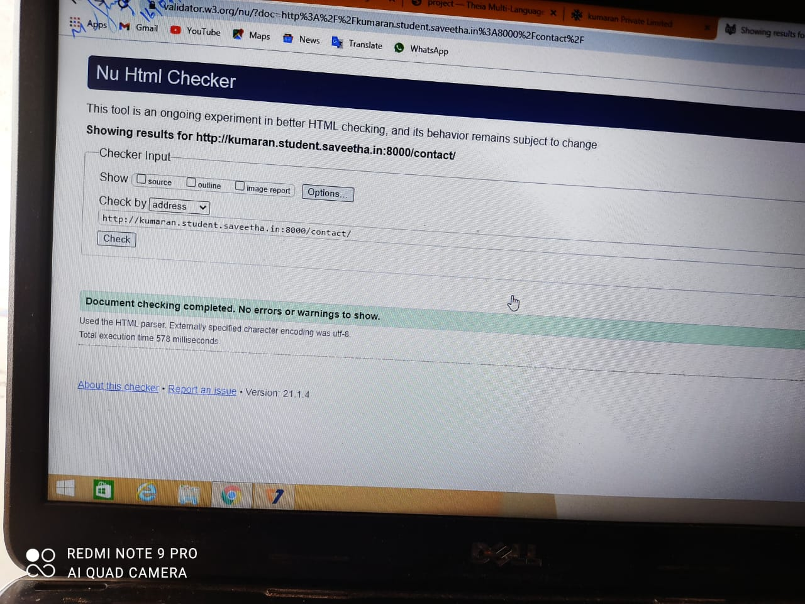

# Web Design for a Manufacturing Company
## AIM: 
To design a static website for a chip manufacturing company.

## DESIGN STEPS:
### Step 1: 
Requirement collection.
### Step 2:
Creating the layout using HTML and CSS.
### Step 3:
Updating the sample content.
### Step 4:
Choose the appropriate style and color scheme.
### Step 5:
Validate the layout in various browsers.
### Step 6:
Validate the HTML code.
### Step 6:
Publish the website in the given URL.

## PROGRAM:

### base.html
```

<!DOCTYPE html>
<html lang="en">

<head>
    <title>kumaran Private Limited</title>
    <link rel="stylesheet" href="">
    <link rel = "icon" href ="" type = "image/x-icon"> 
              
</head>

<body>
    <div class="container">
    <div class="banner">
        kumaran Private Limited.
    </div>
    <div class="menu">
        <div class="menuitem"><a href="/home">Home</a></div> 
        <div class="menuitem"><a href="/products">Products</a></div> 
        <div class="menuitem"><a href="/people">People</a></div>
        <div class="menuitem"><a href="/contact">Contact Us</a></div> 
    </div><div class="content">
        
    
    </div>
    <div class="footer">
        Copyright © 2020 kumaran Private Limited, Developed by kumaran.
    </div>
    </div>
</body>

</html>
```

### home.html
```



    <div class="homecontent">    
    <h1>About Us</h1>
    
    <div class="contenttext">
    Silicon Pvt Ltd, provides a broad range of semiconductor and infrastructure software applications that serve the data center, networking, software, broadband, wireless, and storage and industrial markets. Common applications for its products include: data center networking, home connectivity, broadband access, telecommunications equipment, smartphones, base stations, data center servers and storage, factory automation, power generation and alternative energy systems, displays, and mainframe operations and management, and application software development. Some of Silicon's core technologies and products include:
    <ul>
        <li>Memory Chips</li>
        <li>SATA HDD</li>
        <li>SATA SSD </li>
        <li>Broadband Modems</li>
        <li>Wifi Devices</li>
        <li>Switching Devices</li>
        <li>Optical Sensors</li>
    </ul> 
    </div>
    </div>

```
### products.html
```



    <div class="productcontent">    
    <h1>Our Premium Products</h1>
    <div class="productitems">
        <div class="productitem"> 
            <div class="itemimage">
            
            </div>
            <div class="itemname">4GB DDRA4 laptop memory</div>
            <div class="itemprice">Price: Rs.2000.00 </div>
        </div>
        <div class="productitem"> 
            <div class="itemimage">
            
            </div>
            <div class="itemname">1TB Laptop HDD</div>
            <div class="itemprice">Price: Rs.5000.00 </div>
        </div>
        <div class="productitem"> 
            <div class="itemimage">
            
            </div>
            <div class="itemname">camera</div>
            <div class="itemprice">Price: Rs.1999.00 </div>
        </div>
        <div class="productitem"> 
            <div class="itemimage">
            
            </div>
            <div class="itemname">roller face</div>
            <div class="itemprice">Price: Rs.1319.00 </div>
        </div>
        <div class="productitem"> 
            <div class="itemimage">
            
            </div>
            <div class="itemname">light meter</div>
            <div class="itemprice">Price: Rs.1665.00 </div>
        </div>
        <div class="productitem"> 
            <div class="itemimage">
            
            </div>
            <div class="itemname">gun massager</div>
            <div class="itemprice">Price: Rs.2050.00 </div>
        </div>
        <div class="productitem"> 
            <div class="itemimage">
            
            </div>
            <div class="itemname">multimeter lead</div>
            <div class="itemprice">Price: Rs.199.00 </div>
        </div>
        <div class="productitem"> 
            <div class="itemimage">
            
            </div>
            <div class="itemname">universal remote</div>
            <div class="itemprice">Price: Rs.299.00 </div>
        </div>
        <div class="productitem"> 
            <div class="itemimage">
            
            </div>
            <div class="itemname">smart band</div>
            <div class="itemprice">Price: Rs.500.00 </div>
        </div>
        <div class="productitem"> 
            <div class="itemimage">
            
            </div>
            <div class="itemname">pendrive</div>
            <div class="itemprice">Price: Rs.1299.00 </div>
        </div>
        <div class="productitem"> 
            <div class="itemimage">
            
            </div>
            <div class="itemname">oximeter</div>
            <div class="itemprice">Price: Rs.2999.00 </div>
        </div>
        <div class="productitem"> 
            <div class="itemimage">
            
            </div>
            <div class="itemname">car mobile holder</div>
            <div class="itemprice">Price: Rs.311.00 </div>
        </div>
    </div>
    </div>

```

## people.html
```



    <div class="productcontent">    
    <h1>Our Peoples</h1>
    <div class="productitems">
        <div class="productitem"> 
            <div class="itemimage">
            
            </div>
            <div class="itemname">Anoop handa</div>
            <div class="itemprice">founder </div>
        </div>
        <div class="productitem"> 
            <div class="itemimage">
            
            </div>
            <div class="itemname">sathya pradan</div>
            <div class="itemprice">Ceo </div>
        </div>
        <div class="productitem"> 
            <div class="itemimage">
            
            </div>
            <div class="itemname">sahoo</div>
            <div class="itemprice">Manager </div>
        </div>
        
        <div class="productitem"> 
            <div class="itemimage">
            
            </div>
            <div class="itemname">kamal buddha</div>
            <div class="itemprice">Assistant Manager </div>
        </div>
        <div class="productitem"> 
            <div class="itemimage">
            
            </div>
            <div class="itemname">brando</div>
            <div class="itemprice">supervisor </div>
        </div>
  
      
        <div class="productitem"> 
            <div class="itemimage">
            
            </div>
            <div class="itemname">Parko sateesh</div>
            <div class="itemprice">assitant supervisor </div>
        </div>
    </div>
    </div>

```

## contact.html
```
<!DOCTYPE html>
<html lang="en">

<head>
    <title>kumaran Private Limited</title>
    <link rel="stylesheet" href="/static/css/layout.css">
    <link rel = "icon" href ="/static/img/titleicon.png" type = "image/x-icon"> 
              
</head>

<body>
    <div class="container">
    <div class="banner">
       <h1> kumaran Private Limited</h1>
    </div>
    <div class="menu">
        <div class="menuitem"><a href="/home">Home</a></div> 
        <div class="menuitem"><a href="/products">Products</a></div> 
        <div class="menuitem"><a href="/people">People</a></div>
        <div class="menuitem"><a href="/contactus">Contact Us</a></div> 
    </div><div class="content">
    
    <div class="productcontent">    
    <h1>Contact Us</h1> 
    <div class="productitems">
        <div class="productitem"> 
            <div class="contactname"><h1>E-MAIL : kumaran@gmail.com</h1></div>
            <div class="contactprice"><h1> Contact No : 7305179692 </h1></div>
        </div>
        <div class="productitem"></div>
        <div class="productitem"> 
            <div class="contactimage">
            
            </div>
        </div>
    </div>
    </div> 

    </div>
    <div class="footer">
        Copyright © 2020 Kumaran Private Limited, Developed by KUMARAN.↩
    </div>
    </div>
</body>

</html>
```

## OUTPUT:








## CODE VALIDATION REPORT:








## RESULT:
Thus a website is designed for the chip manufacturing company and is hosted in the URL http://demo2.student.saveetha.in:8000/. HTML code is validated.